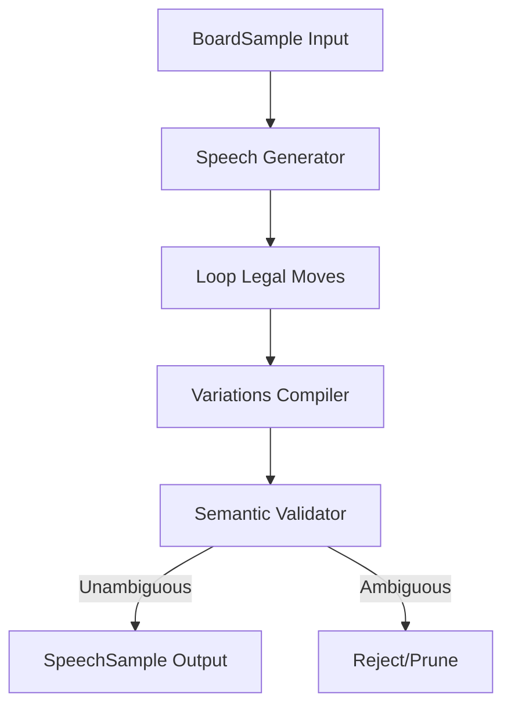

# Speech Generation Engine Architecture

This document describes the design and components of the Speech Generation Engine built for the BlindChess voice training dataset.

## 1. Components

- **`speech_sample.py`**: A clean, dataclass-based model representation of the voice command.
- **`speech_templates.py`**: A dictionary containing piece names, capture verbs, castling terms, checks, promotions, en-passants, and openers.
- **`speech_variations.py`**: Orchestrates style compilation mapping moves to five styles (Formal, Conversational, Minimal, Verbose, Natural).
- **`speech_validator.py`**: A high-performance, regex-based semantic validator. It resolves spoken command text back to candidate legal moves on the board.
- **`speech_generator.py`**: The main orchestration class that converts board samples to validated speech command dicts.

## 2. Performance Optimizations

1. **Pre-compiled Regexes**: Regex compilation is cached at the module level.
2. **Move Candidates Pre-indexing**: Moves are indexed by destination square to prune candidate searches from 30+ moves to 1-2 moves during validation.
3. **Phonetics Skip Check**: Translates spelling phonetics (e.g. `foxtrot` -> `f`) only when phonetic words are present, skipping thousands of string replacements.
