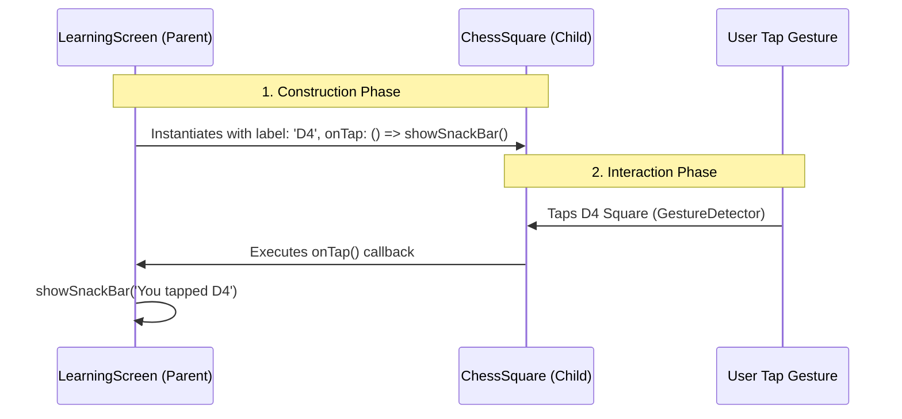

# Day 11: Callbacks & Tap Gestures Notes

Welcome to Day 11! Today, we added interactive functionality to our chessboard. We learned how to pass callback functions from parent screens down to custom stateless widgets, allowing us to capture coordinate clicks dynamically and trigger localized SnackBar notifications.

---

## 1. What is a Callback

In event-driven programming, a **callback function** is a function that is passed as an argument to another block of code (like a custom widget) with the expectation that it will be executed ("called back") when a specific event occurs.

In Flutter, callbacks are how stateless child widgets notify their stateful parent widgets when something happens (such as a tap, long press, or swipe event).

---

## 2. What is VoidCallback

In Dart, **`VoidCallback`** is a built-in type definition (typedef) representing a signature for a function that takes zero arguments and returns nothing (`void`):

```dart
typedef VoidCallback = void Function();
```

When you define `final VoidCallback? onTap;` inside a widget, you are telling the framework that `onTap` can hold any function matching that signature. For example:
- `() { print('Clicked!'); }`
- `_someFunction` (where `_someFunction` takes no arguments).

---

## 3. Parent-Child Communication

In Flutter, data and events flow in opposite directions:
1. **Data flows DOWN**: The parent passes configuration data (like coordinates and square colors) to child widgets using constructor parameters.
2. **Events flow UP**: The child widget notifies the parent about user interactions (like a click) by triggering callback functions passed to it.



---

## 4. GestureDetector vs InkWell

Flutter provides multiple widgets to detect gestures. The two most common are:

| Feature | GestureDetector | InkWell |
| :--- | :--- | :--- |
| **Visual Feedback** | None. Completely invisible wrapper. | Shows a Material ripple/splash animation on tap. |
| **Material Ancestry** | Works anywhere. Does not require a `Material` widget. | Requires a `Material` widget ancestor in the tree to render ripples. |
| **Gesture Scope** | Extremely broad (taps, double taps, long presses, drags, scales). | Focused mainly on basic clicks (`onTap`, `onLongPress`, `onDoubleTap`). |
| **Custom Styling** | Ideal for custom container layouts (no default padding/shadows). | Best for standard Material buttons, list tiles, and cards. |

In our implementation, we wrapped our square in a `GestureDetector` to cleanly capture taps without distorting the chessboard's background colors with the default ripple overlays.

---

## 5. How Tap Events Work

When a user taps the screen:
1. **Hit Testing**: Flutter's rendering engine performs a hit test to determine which widget is located at the exact coordinates of the tap.
2. **Gesture Detection**: The tap event propagates down to the matching `GestureDetector` or `InkWell` widget.
3. **Execution**: The widget catches the gesture and immediately invokes the callback function assigned to its `onTap` parameter.
4. **Action**: The callback executes inside the parent context (e.g. telling the `ScaffoldMessenger` to display a SnackBar).

---

## 6. Why Callbacks Improve Widget Reuse

Callbacks make widgets decoupled and modular. 
- If `ChessSquare` hardcoded its tap behavior (e.g. always showing a SnackBar), it would only be useful on the `LearningScreen`. We wouldn't be able to reuse it in a real game screen where tapping a square needs to select a chess piece instead.
- By defining `onTap` as a constructor parameter, the `ChessSquare` widget remains completely ignorant of what happens when it is tapped.
- The parent screen decides what action to execute. Tapping a square can:
  - Show a SnackBar on the `LearningScreen`.
  - Move a piece on a `GameScreen`.
  - Highlight coordinates on an `AnalysisScreen`.

This separation of concerns makes our custom widgets highly flexible and reusable.

---

Congratulations on completing Day 11! You have successfully mastered parent-child callbacks and interactivity in Flutter.
