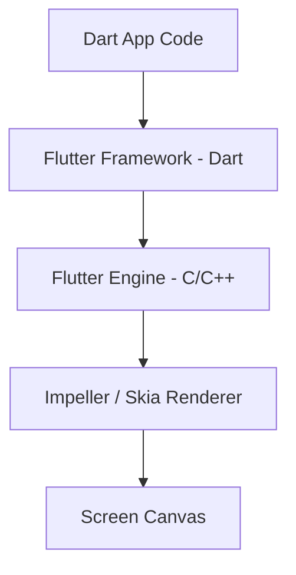
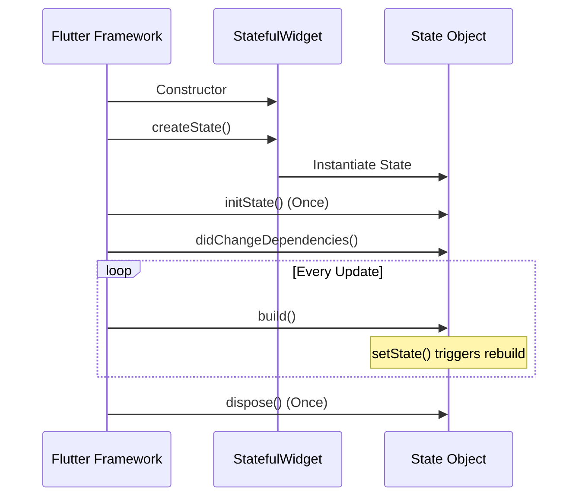

# Day 1 Master Notes: Foundational Flutter & Dart

Welcome to Day 1 of your journey to becoming a professional Flutter developer. This comprehensive guide covers the core architecture of Flutter, Dart language fundamentals, widget rendering mechanics, and project layout.

---

## 1. What is Flutter?
**Flutter** is Google's multi-platform UI software development kit (SDK). It allows you to build beautiful, natively compiled applications for mobile (iOS, Android), web, desktop (macOS, Windows, Linux), and embedded devices from a **single codebase**.

### Core Architecture Principles
Unlike other cross-platform frameworks, Flutter does not rely on web wrappers (WebViews) or native platform widgets. Instead:
* **Custom Rendering Engine:** Flutter compiles your Dart code into native ARM/Intel machine code. It uses its high-performance graphics engine (**Impeller** or **Skia**) to draw every pixel of the user interface directly on the screen.
* **Consistency:** Because Flutter renders the UI pixel-by-pixel, your application will look and behave identically on iOS, Android, Windows, and macOS.
* **Rich Visuals:** You have complete control over every pixel on the screen, allowing for smooth 60fps/120fps animations, custom designs, and premium aesthetics.



---

## 2. What is Dart?
**Dart** is a client-optimized, type-safe programming language developed by Google. It is the language used to write all Flutter applications.

### Key Dart Language Features
1. **Strong & Sound Typing:** Every variable has a type (e.g., `int`, `double`, `String`, `Widget`). This type safety catches errors during compile time rather than runtime.
2. **Type Inference:** You can declare variables with `var` or `final`, and Dart will automatically infer the type based on the initial value.
3. **Sound Null Safety:** Dart guarantees that variables cannot be `null` unless you explicitly declare them as nullable (using the `?` operator, e.g., `String? name`). This eliminates the notorious "null pointer exception" crashes in production.
4. **Compilation Pipeline:**
   * **Just-In-Time (JIT) Compilation:** During development, Dart compiles code incrementally. This powers Flutter's near-instant **Hot Reload**.
   * **Ahead-Of-Time (AOT) Compilation:** For production, Dart compiles your code into native machine code, optimizing startup time and overall performance.

### Dart Syntax Cheat Sheet
```dart
// Declaring typed variables
int counter = 0;
String title = "BlindChess";
bool isGameOver = false;

// Constant vs Final
final DateTime now = DateTime.now(); // Read-only, set at runtime
const double pi = 3.14159;          // Compile-time constant, highly optimized

// Null Safety
String? middleName; // Can be null
String lastName = "Smith"; // CANNOT be null

// Standard Function
int add(int a, int b) {
  return a + b;
}

// Arrow syntax for single-expression functions
int subtract(int a, int b) => a - b;
```

---

## 3. The Three Trees of Flutter
One of the most important concepts for a Flutter engineer is understanding how Flutter compiles and renders UI behind the scenes. Flutter maintains **three trees** in parallel:

1. **The Widget Tree:** 
   * A declarative description of the user interface.
   * Widgets are configuration blueprints. They are lightweight, cheap to create, and are rebuilt constantly.
2. **The Element Tree (The Glue):**
   * Manages the lifecycle of widgets and controls UI updates.
   * Elements map the widgets (blueprints) to the actual rendered objects. They are persistent and do not get destroyed on every rebuild.
3. **The RenderObject Tree:**
   * Performs the layout computations, paints the pixels, and handles hit-testing.
   * These are heavy objects that are only updated when layout details (sizes, constraints, positions) change.

```
[ WIDGET TREE ]             [ ELEMENT TREE ]          [ RENDEROBJECT TREE ]
MyHomePage (Widget)  <───>  StatefulElement    <───>  RenderParagraph / RenderFlex
    └── Scaffold     <───>  StatelessElement   <───>  RenderPadding
```

> [!NOTE]
> This separation is why Flutter is incredibly fast. When you rebuild a widget, Flutter compares the new widget configuration against the persistent element. If the widget type matches, it simply updates the properties on the existing `RenderObject` instead of recreating the heavy rendering elements from scratch.

---

## 4. BuildContext & The Build Method

### The `build()` Method
The `build()` method is the entry point for rendering. Every widget must implement it:
```dart
@override
Widget build(BuildContext context) {
  return Container();
}
```
* **Pure & Synchronous:** The build method should be a pure function. It should read configuration data and return a widget tree. Never make network requests, database calls, or modify state directly inside the build method.

### What is `BuildContext`?
`BuildContext` is a handle to the location of a widget in the overall Widget Tree.
* It tells a widget **where** it is located relative to other widgets.
* It allows widgets to lookup data from ancestor widgets higher in the tree. For example, `Theme.of(context)` uses the `context` to walk up the tree and find the nearest `Theme` widget to read current colors.

---

## 5. Stateless vs. Stateful Widgets

### StatelessWidget
* **Definition:** A widget that does not maintain any mutable internal state. 
* **Lifecycle:** It is constructed, built once, and destroyed when it is no longer needed.
* **Code Example:**
```dart
class TextDisplay extends StatelessWidget {
  final String text;
  
  const TextDisplay({super.key, required this.text});

  @override
  Widget build(BuildContext context) {
    return Text(text);
  }
}
```

### StatefulWidget
* **Definition:** A widget that can change its appearance dynamically in response to user events, timers, or animations.
* **Structure:** It consists of two separate classes:
  1. The **Widget Configuration Class** (extends `StatefulWidget`): Immutable blueprint.
  2. The **State Class** (extends `State`): Mutable class that contains the variables and logic.

### StatefulWidget Lifecycle Methods
A stateful widget has a complex lifecycle that you must understand:
1. **`createState()`**: Called immediately when the widget is inserted into the tree.
2. **`initState()`**: Called exactly once when the state object is created. Used for initializing variables, controllers, or database listeners.
3. **`didChangeDependencies()`**: Called immediately after `initState()` and whenever an inherited widget dependency (like a Theme or Provider) changes.
4. **`build()`**: Called every time `setState()` is executed, or when the parent updates the widget configurations.
5. **`dispose()`**: Called when the widget is permanently removed from the tree. Used to clean up memory (disposing controllers, cancel timers, close streams).



---

## 6. Detailed Widget Breakdown

Here is a breakdown of the common foundation widgets used in the counter application:

* **`MaterialApp`**: The root configuration widget for Material Design applications. It configures the navigator, localization, title, and theme lookup.
* **`ThemeData`**: Defines styling rules (colors, fonts, sizes). Changing `ThemeData` changes the appearance of all standard widgets globally.
* **`Scaffold`**: The structural boilerplate of a page. It lays out the header (`appBar`), content area (`body`), floating buttons, drawer panels, and navigation bars.
* **`AppBar`**: The standard top header bar. By default, it automatically renders a back button if a back-route is available.
* **`Center`**: A layout utility widget that aligns its single child in the exact center of its parents bounds.
* **`Column`**: A layout widget that arranges its children vertically.
* **`FloatingActionButton`**: A prominent circular action button. In Material 3, it defaults to a rounded square shape.
* **`setState()`**: A method inside the `State` class. It schedules a refresh of the user interface by executing the widget's `build()` method again using the modified variables.

---

## 7. Hot Reload vs. Hot Restart

### Hot Reload (`r`)
* **How it works:** Compiles modified source code files and injects them directly into the running Dart VM.
* **State Preservation:** Keeps the current application state (variable values, scroll positions, inputs).
* **Speed:** Instant (~100ms - 500ms).
* **Limitation:** Cannot apply changes to static variables, initializer blocks, main function modifications, or state structure changes.

### Hot Restart (`R`)
* **How it works:** Recompiles changed files, destroys the current application state, and restarts the program from the `main()` method.
* **State Preservation:** Resets the application back to its initial state.
* **Speed:** Slightly slower (~1s - 3s).
* **Use case:** Essential when modifying dependencies in `pubspec.yaml`, modifying static variables, asset registers, or structural routing parameters.

---

## 8. Project Folder Directory Reference

| Path | Purpose | Key Files to Watch |
| :--- | :--- | :--- |
| **`lib/`** | The core development source directory | [`main.dart`](file:///C:/Users/nnysu/OneDrive/Desktop/chess/lib/main.dart) |
| **`test/`** | Testing suite for unit & widget tests | [`widget_test.dart`](file:///C:/Users/nnysu/OneDrive/Desktop/chess/test/widget_test.dart) |
| **`android/`** | Native Android platform wrapper | `build.gradle.kts`, `AndroidManifest.xml` |
| **`ios/`** | Native iOS platform wrapper | `Info.plist`, `Podfile` |
| **`web/`** | Native web application hosting files | `index.html`, `manifest.json` |
| **`windows/`** | Native Windows desktop build setup | `CMakeLists.txt` |
| **`macos/`** | Native macOS desktop build setup | `Runner.xcodeproj` |
| **`linux/`** | Native Linux desktop build setup | `CMakeLists.txt` |
| **`pubspec.yaml`** | Package manifest and resource registration | Defines packages, fonts, and assets |
| **`analysis_options.yaml`** | Project rules and styles checklist | Code standards configuration |
