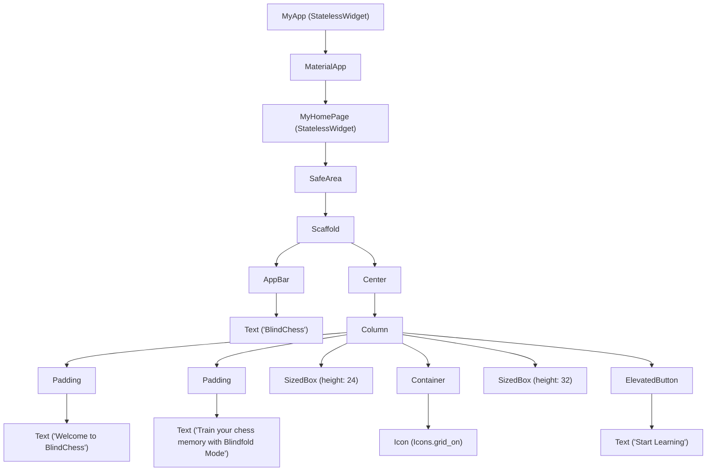

# Day 4: Flutter Widgets & Layout Notes

Welcome to Day 4! Today, we transformed the default Flutter counter template into the foundation of our **BlindChess** application. In doing so, we explored some of the most fundamental widgets that compose the visual structure of a Flutter application.

---

## 1. What Changed from the Counter App

The default Flutter counter application is designed to demonstrate state management using a `StatefulWidget` and a floating action button. For the **BlindChess** home screen, we replaced it with a simpler, cleaner, and more semantic architecture:

1. **Replaced `StatefulWidget` with `StatelessWidget`**: Since our home page currently only displays static information (with a SnackBar notification that doesn't require modifying widget-local state), we converted `MyHomePage` into a `StatelessWidget`. This keeps the code clean and beginner-friendly.
2. **Simplified the UI & Theme**: We updated the app bar title to "BlindChess", the application metadata title to "BlindChess Learning", and aligned the seed color of our theme to `Colors.deepPurple`.
3. **Replaced UI Elements**: We removed the counter numeric cards and the Floating Action Button, replacing them with a custom puzzle/chess-like grid icon and a modern "Start Learning" `ElevatedButton`.
4. **Interactive Action via SnackBar**: Instead of modifying a numeric variable when tapping, clicking the button now leverages the `ScaffoldMessenger` context to display a sliding alert notification (a SnackBar) reading: *"BlindChess journey begins!"*

---

## 2. Widget Tree Explanation

In Flutter, **everything is a widget**. Widgets are nested inside one another, forming a hierarchical tree structure. Here is how our updated application's widget tree looks:



### Tree Walkthrough:
* **Root (`MyApp`)**: Sets up the app container.
* **`MaterialApp`**: Declares theme styling and configuration.
* **`MyHomePage`**: Defines the main screen layout.
* **`SafeArea`**: Restricts the UI within the device's visible boundaries (notches, status bars).
* **`Scaffold`**: Outlines the standard visual page framework.
  * **`AppBar`**: Places a bar at the top with the title "BlindChess".
  * **`Center`**: Aligns the main body column exactly in the middle of the screen.
    * **`Column`**: Arranges the children widgets linearly from top to bottom.
      * **`Padding` (Welcome Message)** -> containing the header **`Text`**.
      * **`Padding` (Sub-headline)** -> containing the description **`Text`**.
      * **`SizedBox`**: Adds non-visual spacing between widgets.
      * **`Container`**: Draws a circular purple background area for our chess icon.
        * **`Icon`**: Displays the `grid_on` chess-like visual asset.
      * **`ElevatedButton`**: Displays a clickable button with label **`Text`**.

---

## 3. Scaffold Explanation

The `Scaffold` widget is the structural skeleton of a Material Design page. It manages the overlapping and alignment details of multiple screen components so you do not have to write custom positioning logic. 

Key features and zones provided by `Scaffold` include:
* **`appBar`**: Slot for a top-docked header (displays back buttons, titles, and menus).
* **`body`**: The primary content area of the screen (here, our centered column).
* **`floatingActionButton`**: A circular button that floats over the content to highlight the primary action.
* **`drawer`**: A slide-in panel from the side for navigation menus.
* **`bottomNavigationBar`**: A persistent bar at the bottom for tab-based navigation.
* **`SnackBar / BottomSheet support`**: Connects with `ScaffoldMessenger` to display transient overlay messages.

---

## 4. Layout Widgets Learned Today

We utilized several crucial layout widgets to organize our components:

### Center
Centers its direct child widget both horizontally and vertically within the parent's container. It is a convenience wrapper around an `Align` widget.

### SafeArea
Prevents content from spilling into unsafe regions of the physical screen—such as phone notches, status bars, and hardware button overlays. It uses the device's media queries to dynamically calculate padding.

### Column
A multi-child layout widget that arranges its children vertically.
* **`mainAxisAlignment`**: Configures spacing along the main axis (vertical). By setting it to `MainAxisAlignment.center`, we tell Flutter to group all widgets in the middle of the vertical height.
* **`crossAxisAlignment`**: Configures alignment along the cross axis (horizontal).

### Padding
Instead of having margins or padding built directly into every single widget, Flutter uses the single-responsibility principle: you wrap any widget inside a `Padding` widget to specify empty space (insets) around it.
* Example: `EdgeInsets.symmetric(horizontal: 24.0, vertical: 8.0)` inserts spacing only on the sides and the top/bottom.

### Container
A convenient widget that combines multiple properties:
* **Sizing**: You can specify exact `width` and `height`.
* **Padding & Margins**: Spacing inside and outside the container boundaries.
* **Decoration**: Using `BoxDecoration`, you can set a background color, custom border radius, shadow, or change the shape (e.g., `BoxShape.circle`).

---

## 5. How Button Events Work

In Flutter, interactivity is event-driven. User gestures (like taps and clicks) trigger callback functions.

1. **The callback: `onPressed`**: Custom buttons like `ElevatedButton`, `TextButton`, or `OutlinedButton` have an `onPressed` property. It accepts a `VoidCallback`—a function that takes no arguments and returns nothing (`void`).
2. **Anonymous Functions**: We define this callback inline:
   ```dart
   onPressed: () {
     // Code to run when the button is tapped
   }
   ```
3. **Triggering actions (SnackBar)**: Inside this function, we interact with the framework. By calling `ScaffoldMessenger.of(context).showSnackBar()`, we tell Flutter to find the closest `Scaffold` ancestor in the widget tree using the build `context`, and command it to slide a SnackBar up from the bottom of the screen.

---

Congratulations on completing Day 4! You've mastered the fundamentals of creating a static layout with interactive feedback in Flutter.
