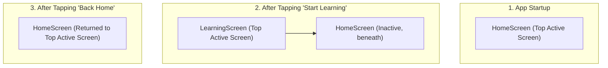

# Day 5: Screen Separation & Navigation Notes

Welcome to Day 5! Today, we took a major step toward building a real multi-screen Flutter application by moving our landing page UI out of `main.dart` and setting up navigation to a new screen.

---

## 1. Why We Separated Screens

When you begin writing a Flutter application, it is tempting to place all your widgets in a single file like `main.dart`. However, as your app grows, this approach quickly breaks down. We moved our UI into a new `lib/screens/` folder for several critical reasons:

1. **Maintainability & Readability**: Smaller files focusing on one screen or widget are easier to read and modify. A single file containing thousands of lines of code is difficult to navigate.
2. **Separation of Concerns (Single Responsibility Principle)**: `HomeScreen` handles only the entry screen logic. `LearningScreen` handles only learning interface logic. This makes debugging isolated issues straightforward.
3. **Team Collaboration**: If multiple developers work on the same app, separating code into multiple files prevents them from editing the same file at the same time, avoiding tedious git merge conflicts.
4. **Reusability**: Organizing components in folders allows other screens to easily import and reuse sub-widgets.

---

## 2. main.dart Responsibility

In a well-designed Flutter application, `lib/main.dart` is the **bootstrapper**. It should only perform:
- **Initialization**: Initializing external services, databases, or state management tools (like Firebase, Hive, or Provider).
- **Application Setup**: Running the root `runApp()` command.
- **Global Configuration**: Setting up the top-level `MaterialApp` widget, configuring application metadata (like title), themes, and top-level navigation routes.

By moving screen layouts to `lib/screens/`, `main.dart` remains extremely small, clean, and focused solely on starting the application.

---

## 3. Screen Navigation Explanation

To move between screens, Flutter uses two primary concepts: **Routes** and the **Navigator**.

### Route
A **Route** represents an abstraction for a "screen" or "page" in your application. In a mobile app, it corresponds to the screen transition and representation.

### MaterialPageRoute
This is a helper class provided by the Material library. It wraps your destination widget (e.g. `LearningScreen`) and automatically handles:
- **Transition animations**: Sliding in from the side/bottom depending on the platform (iOS vs Android).
- **Platform-specific back gestures**: Swiping from the left edge of the screen on iOS to go back.

### The Navigator API
To navigate, we communicate with the framework's `Navigator` using the current BuildContext:

- **Navigating forward (`Navigator.push`)**:
  ```dart
  Navigator.push(
    context,
    MaterialPageRoute(builder: (context) => const LearningScreen()),
  );
  ```
  We ask the Navigator to push a new route onto its stack.

- **Navigating backward (`Navigator.pop`)**:
  ```dart
  Navigator.pop(context);
  ```
  We ask the Navigator to remove the top-most route and return to the previous screen.

---

## 4. Navigator Stack Concept

The `Navigator` operates exactly like a **Stack** data structure in computer science. It follows the **LIFO (Last In, First Out)** principle.

Here is a visual breakdown of how the screen stack changes during our navigation flow:



### Stack Lifecycle:
1. **Initial State**: The stack has a single entry: `[ HomeScreen ]`. It is the active screen.
2. **Push operation (`Navigator.push(...)`)**: We push `LearningScreen` onto the stack. The stack becomes:
   ```
   [ LearningScreen ]  <-- Top of stack (visible to user)
   [ HomeScreen     ]
   ```
   `HomeScreen` is still alive in memory underneath, but is inactive and covered by the animation.
3. **Pop operation (`Navigator.pop(context)`)**: We pop the top item off the stack. The stack becomes:
   ```
   [ HomeScreen ]      <-- Top of stack (visible to user)
   ```
   `LearningScreen` is completely destroyed (disposed) and removed from memory.

---

Congratulations on completing Day 5! You now have a solid understanding of how to architect modular screens and handle routing in Flutter.
