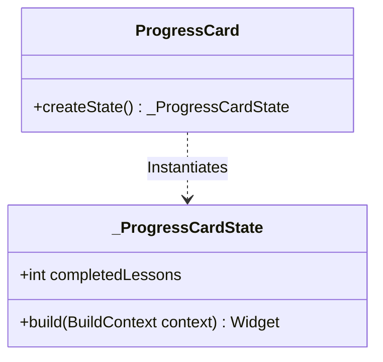

# Day 7: Basic State Management with StatefulWidget Notes

Welcome to Day 7! Today, we took our first steps into local state management in Flutter. We built the **`ProgressCard`** widget as a `StatefulWidget`, maintaining a mutable counter of completed lessons and updating our interface dynamically via `setState()`.

---

## 1. What is a StatefulWidget

A **`StatefulWidget`** is a widget that describes a portion of the user interface that can dynamically alter its configuration, data, or appearance over time in response to user events, timers, or network requests. 

Unlike a `StatelessWidget`, a `StatefulWidget` is mutable. It acts as a configuration template that links itself to a separate, long-lived **`State`** object which holds the variables and handles the widget's rebuild logic.

---

## 2. StatelessWidget vs StatefulWidget Comparison

| Feature | StatelessWidget | StatefulWidget |
| :--- | :--- | :--- |
| **Mutability** | Immutable (constant once built). | Mutable (data changes at runtime). |
| **Variables** | All fields must be marked `final`. | Fields in the companion `State` class can be non-final. |
| **Internal Memory** | None. Cannot remember past user actions. | Remembers information across redraws. |
| **Trigger Rebuild** | Rebuilds only when parent widget updates. | Can trigger its own rebuild using `setState()`. |
| **Primary Use Case** | Displaying static data (text, icons, headers). | Handling dynamic user interactions (forms, counters, toggles). |

---

## 3. State Class Explanation

In Flutter, widgets are constantly destroyed and rebuilt. If we kept mutable variables inside the widget class itself, those variables would be reset to their default values every single time the widget redraws.

To prevent this, Flutter splits a stateful component into two parts:
1. **The Widget (`StatefulWidget`)**: A temporary configuration block. It is lightweight, immutable, and recreated frequently.
2. **The State (`State`)**: A persistent object that lives in memory across multiple redraws of the widget. This is where our mutable variables (like `completedLessons`) are stored.

---

## 4. setState() & The Widget Rebuild Process

### What setState() Does
`setState(VoidCallback fn)` is the core method used to update local widget states. It does two things:
1. Executes the function code you pass in (e.g. `completedLessons++;`).
2. Notifies the Flutter framework that this State's configuration is now out-of-sync ("dirty") and needs to be repainted.

### How Rebuilding Works
When `setState()` is called:
1. Flutter flags the stateful element in the element tree as **dirty**.
2. On the very next screen refresh frame, the framework schedules a redraw.
3. The framework executes the `build(BuildContext context)` method of our `_ProgressCardState` class.
4. A new layout subtree is returned and compared with the previous tree. Only the parts of the layout that changed (the Text showing the number of lessons) are updated on the screen.

---

## 5. Widget Lifecycle Basics

A `StatefulWidget` goes through a series of lifecycle events from creation to destruction. Here are the core methods:

1. **`createState()`**: Called immediately when the widget is inserted into the tree. Creates the companion State object.
2. **`initState()`**: Called exactly once when the State object is created and initialized. Perfect for setting up default configurations, loading local caches, or initiating listeners.
3. **`didChangeDependencies()`**: Called immediately after `initState()` and whenever dependencies (like InheritedWidgets or Themes) update.
4. **`build()`**: Called every time the widget needs to be drawn. This happens after `initState()`, after `didUpdateWidget()`, and whenever `setState()` is invoked.
5. **`dispose()`**: Called when the widget is permanently removed from the widget tree. Used to clean up memory, close database controllers, cancel timers, and close streams.

---

## 6. Why Applications Need State Management

Without state management, applications would be completely static and unresponsive. State management is critical because it:
- **Tracks User Interactions**: Keeps track of what the user is typing, which items they checked, or which page they are on.
- **Maintains App State**: Ensures progress is kept as you navigate back and forth.
- **Syncs UI with Data**: Reflects backend updates, database changes, or user inputs onto the visual user interface in real-time.

---

## 7. Trace: Counter Changing from 0 to 1

Here is a step-by-step lifecycle flow of how the `completedLessons` counter updates:

1. **Initialization**: The `ProgressCard` is drawn. `completedLessons` starts at `0`. The screen displays: `Completed Lessons: 0`.
2. **Action**: The user taps the "Complete Lesson" button.
3. **Trigger**: The `onPressed` callback fires, executing `setState(() { completedLessons++; });`.
4. **Execution**: The local variable is incremented: `0` becomes `1`.
5. **Invalidation**: Flutter marks the card's state as dirty.
6. **Rebuild**: Flutter calls `build()` on `_ProgressCardState`.
7. **Redraw**: The `Text` widget is compiled with the new value: `'Completed Lessons: 1'`. The screen updates to show `Completed Lessons: 1`.

---

Congratulations on completing Day 7! You have successfully mastered the foundation of local stateful components in Flutter.
