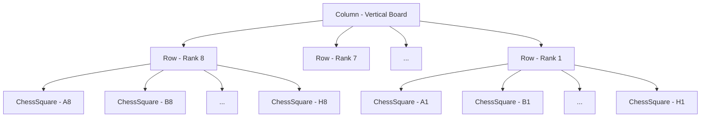

# Day 9: Chessboard Widget Composition Notes

Welcome to Day 9! Today, we achieved a major milestone by building a complete, visually alternating 8×8 chessboard on our `LearningScreen`. We composed 64 chess squares using our custom `ChessSquare` widget, demonstrating layout nesting and clean UI patterns.

---

## 1. How an 8×8 Board is Built

A chessboard is a two-dimensional grid composed of 8 ranks (rows) and 8 files (columns).
To build this in Flutter, we leverage the power of widget composition:
1. **Ranks (Rows)**: We create 8 distinct rank containers horizontally. Each rank is represented by a `Row` widget containing 8 `ChessSquare` widgets.
2. **Board (Column)**: We stack these 8 rank `Row` widgets vertically inside a single `Column` widget to construct the grid.
3. **Alternating Colors**: We dynamically calculate the color (brown or white) for each square based on its column and row index to match the alternating checker pattern.

---

## 2. Nested Row and Column Explanation

Nesting is the process of placing widgets inside other widgets. To build the grid layout:
- **Parent: Column**: Acts as the vertical stacker. It determines the height of the board and holds all 8 ranks.
- **Children: Rows**: Act as the horizontal lines. Each Row houses a file index from 0 to 7 (A to H).
- **Grandchildren: ChessSquare**: The leaf widgets that represent individual chess squares.

---

## 3. Widget Composition

Flutter does not have a native "Grid" element in its core layout that pre-defines chess boards. Instead, it expects developers to compose complex designs out of fundamental building blocks.

Our board is composed of:
- `SingleChildScrollView` (gives scrolling capabilities to avoid overflows).
- `Center` (centers the board horizontally).
- `Column` (arranges the board ranks vertically).
- `Row` (arranges the squares horizontally).
- `ChessSquare` (renders borders, background colors, and centering labels).
- `Text` (displays labels and headers).

This approach makes layout development highly predictable and transparent.

---

## 4. Reusable Widgets vs Duplicate Code

If we did not have a reusable `ChessSquare` widget, we would have to copy and paste the `Container` widget with its sizing, `BoxDecoration`, borders, and labels **64 times**! 

That would result in:
- Roughly **1,000+ lines of duplicate code** inside `learning_screen.dart`.
- Massive maintenance headaches: if we decided to change the border width or font size of our squares, we would have to edit 64 separate places.

By packaging this inside `ChessSquare`, we keep our layout definition incredibly small and maintain a single source of truth. We can generate all 64 squares dynamically in just a few lines of code!

---

## 5. How Chessboard Coordinates Work

A standard chessboard uses algebraic notation to coordinate positions:
- **Files (Columns)**: Represented by letters from **A** to **H** (left-to-right).
- **Ranks (Rows)**: Represented by numbers from **1** to **8** (bottom-to-top).

### Algebraic Grid Layout
In the real world:
- The bottom-left square is **A1** (which is always **dark/brown**).
- The top-left square is **A8** (which is always **light/white**).

To implement this index mapping mathematically:
- Let `rankIndex` run from `0` (top, rank 8) to `7` (bottom, rank 1).
- Let `fileIndex` run from `0` (column A) to `7` (column H).
- Since `A1` (file index 0, rank index 7) has a sum of indices `7 + 0 = 7` (odd), any square where `(rankIndex + fileIndex)` is **odd** will be **dark/brown**.
- Conversely, any square where the sum is **even** (like `A8` where `0 + 0 = 0` or `B8` where `0 + 1 = 1`) will be **light/white**.

---

Congratulations on completing Day 9! You have successfully composed a full 8×8 grid using nested layouts and reusable components.
